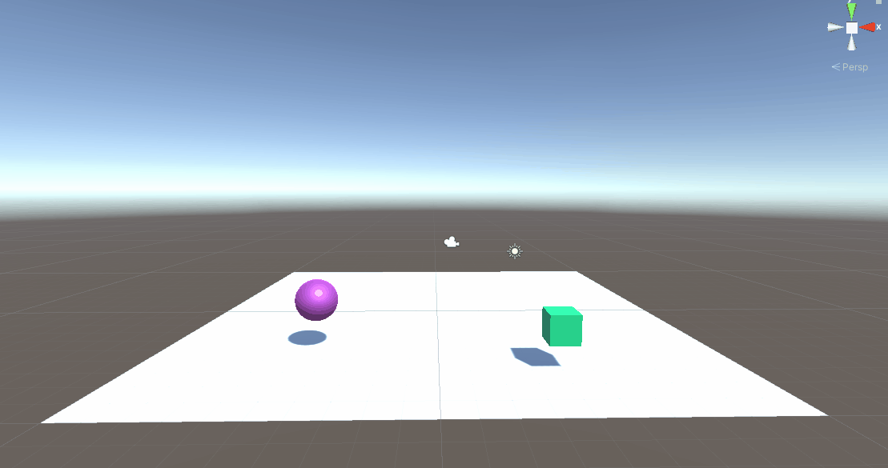
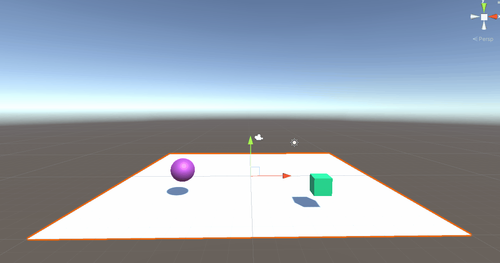
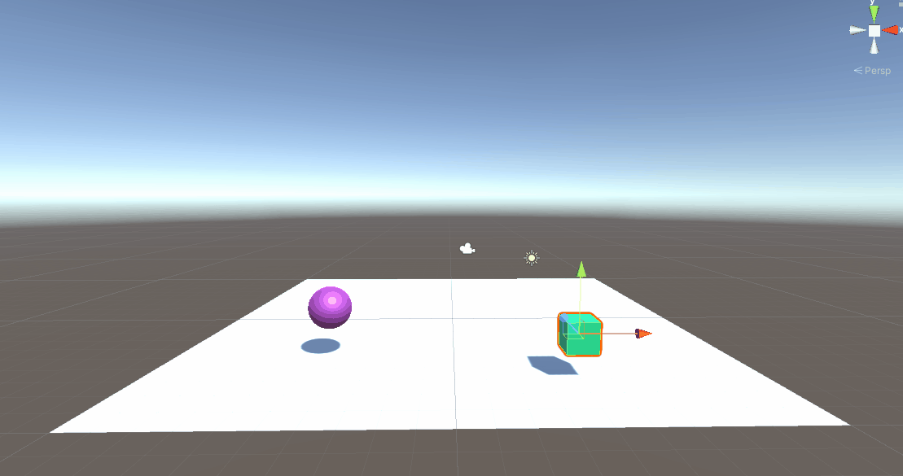
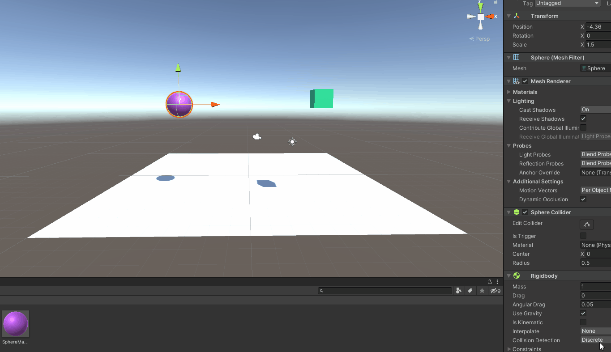
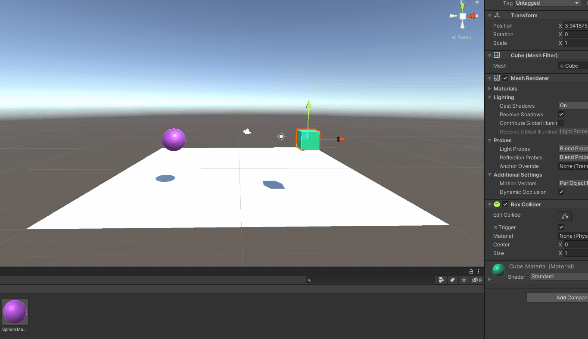
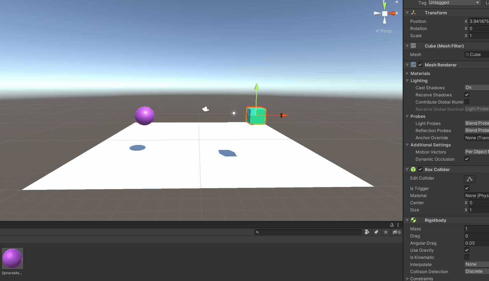
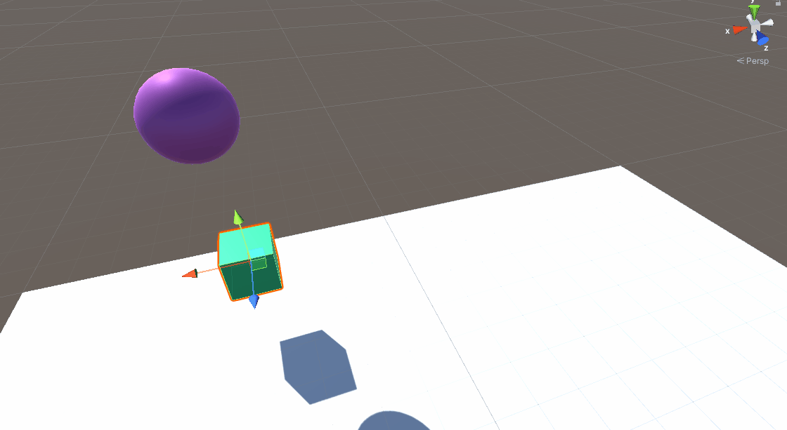

## Práctica 2 - Interfaces Inteligentes

### 1)
*a.*  Ninguno de los objetos será físico.
  

*b.*  La esfera tiene físicas, el cubo no.

*c.*  La esfera y el cubo tienen físicas.

*d.* La esfera y el cubo son físicos y la esfera tiene 10 veces la masa del cubo

*e.*  La esfera tiene físicas y el cubo es de tipo isTrigger

*f.*  La esfera tiene físicas, el cubo es de tipo isTrigger y tiene físicas.

*g.*  La esfera y el cubo son físicos y la esfera tiene 10 veces la masa del cubo, se impide la rotación del cubo sobre el plano XZ.  
Ejemplo *con* rotación:  

Ejemplo *sin* rotación:  
