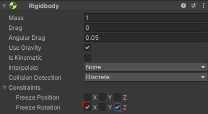
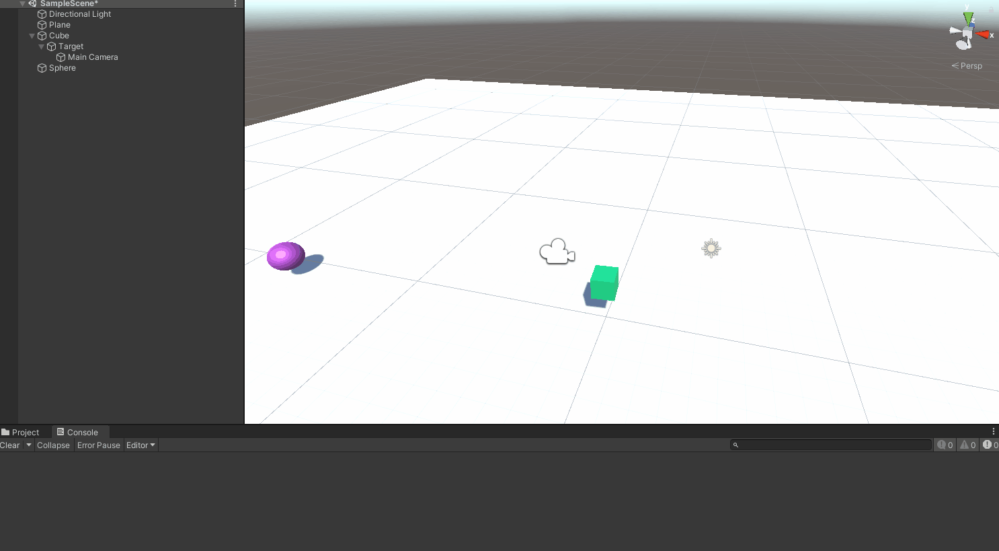
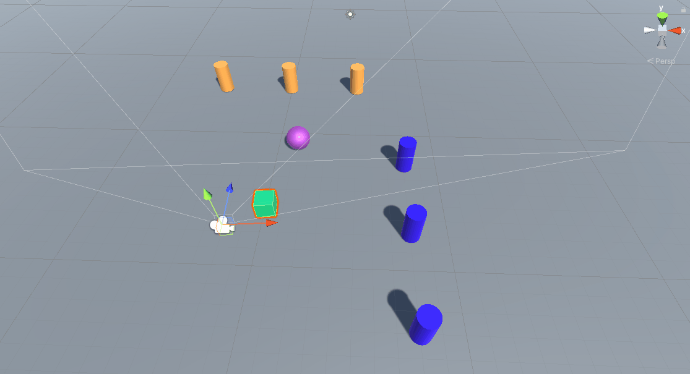

## Práctica 2 - Interfaces Inteligentes

### 1)
*a.*  Ninguno de los objetos será físico.
  

*b.*  La esfera tiene físicas, el cubo no.


*c.*  La esfera y el cubo tienen físicas.


*d.* La esfera y el cubo son físicos y la esfera tiene 10 veces la masa del cubo


*e.*  La esfera tiene físicas y el cubo es de tipo isTrigger


*f.*  La esfera tiene físicas, el cubo es de tipo isTrigger y tiene físicas.


*g.*  La esfera y el cubo son físicos y la esfera tiene 10 veces la masa del cubo, se impide la rotación del cubo sobre el plano XZ.



Ejemplo **con** rotación:  


Ejemplo **sin** rotación:  


### 2)

Para este ejercicio creé dos scripts:  

**CharacterController.cs**

```C#
using System.Collections;
using System.Collections.Generic;
using UnityEngine;

public class CharacterController : MonoBehaviour
{

    public float speed = .1f;

    void Update()
    {
      PlayerMovement();
    }

    void PlayerMovement()
    {
      float hor = Input.GetAxis("Horizontal");
      float ver = Input.GetAxis("Vertical");
      Vector3 playerMovement = new Vector3(hor, 0.0f, ver);
      Debug.Log(playerMovement);
      transform.Translate(playerMovement * speed * Time.deltaTime, Space.Self);
    }
}
```

**CameraController.cs**

```C#
using System.Collections;
using System.Collections.Generic;
using UnityEngine;

public class CameraController : MonoBehaviour
{
    void Start()
    {
      Cursor.visible = false;
      Cursor.lockState = CursorLockMode.Locked;
    }
    public float rotationSpeed = 1;
    public Transform Target, Player;
    float mouseX, mouseY;

    void LateUpdate()
    {
        CamControl();
    }

    void CamControl()
    {
      mouseX += Input.GetAxis("Mouse X") * rotationSpeed;
      mouseY -= Input.GetAxis("Mouse Y") * rotationSpeed;
      mouseY = Mathf.Clamp(mouseY, -35, 30);

      transform.LookAt(Target);

      Target.rotation = Quaternion.Euler(mouseY, mouseX, 0);
      Player.rotation = Quaternion.Euler(0, mouseX, 0);
    }
}
```

El primero nos sirve para mover el cubo en función de lo que introduzca el jugador con las flechas AWSD. El segundo script sirve para mover la cámara en función del ratón, y que siempre la flecha W sea hacia adelante. Por último, se añadió un campo público "velocidad" que se puede modificar desde el inspector de objetos.  


Aquí tenemos un ejemplo del resultado:   


### 3)

Para el tercer ejercicio se cambió de un cubo no físico a uno físico. Para ello, tuve que modificar el script de movimiento para que no se moviera con Translate sino con velocity. Para otros objetos usé AddForce y MovePosition, así conseguí probar todos los método de movimiento de los RigidBody. Puede consultar este nuevo script en: "Scripts/RigidBodyController.cs".

**a)** *Scripts/CylinderType0.cs*

Resultado:  


**b)** *Scripts/PushScript.cs*  
En el primer cilindro, empujo con el cubo sin pulsar el espacio, en cambio, cuando empujo el segundo cilindro apretando espacio, vemos que el cilindro es empujado con mucha más fuerza.

Resultado:  


**c)** *Scripts/WalkAwayCylinder.cs*

Resultado:  


**d)** *Scripts/IJKLCharacterController.cs*  
Para esta tarea creé una esfera y le añadí físicas añadiendo el componente RigidBody.

Resultado:  



**e)** *Scripts/IncreasingCube.cs*

Resultado:  

